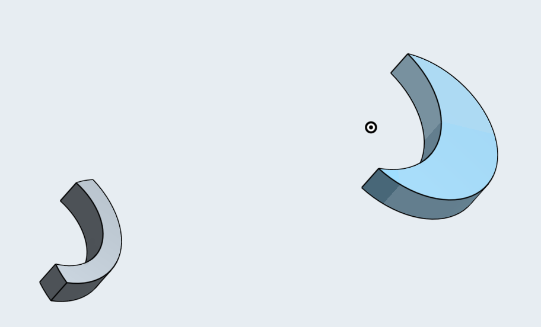
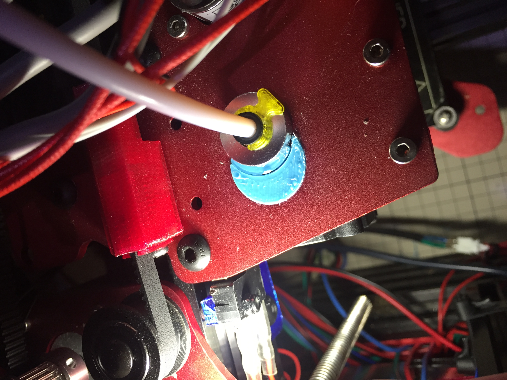

# Support for E3D v6 Heatsink in Earlier Revision Talos Spartan X Carriage
An earlier version of the Talos Spartan X carriage was not providing enough support for the E3Dv6 heatsink so the  hot-end assembly was able to shake in the carriage plate

Here is a two piece fix that was created in onshape, [here](https://cad.onshape.com/documents/3b513f7c7b359355e0b39899/w/374ca0d62142e456f9c6a1b5/e/b6972f3827a6391c4386dd05) are the design files. Depending on the precision and calibration of your printer you might need to adapt the design or scale the stls before printing so you get optimal fit to reduce the wobble of the hot-end assembly.

The small piece is used to support the heatsink, the bigger piece keeps the small piece in place.

 
